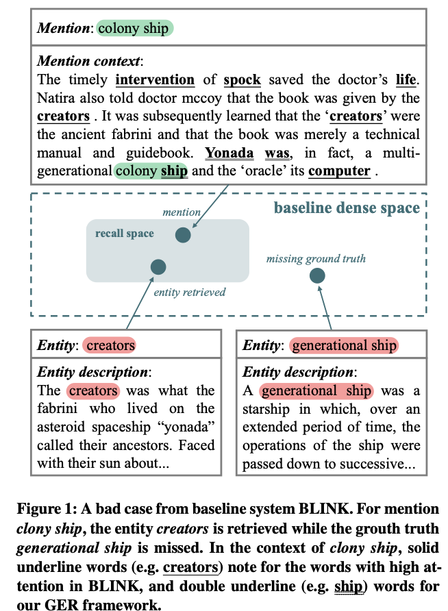
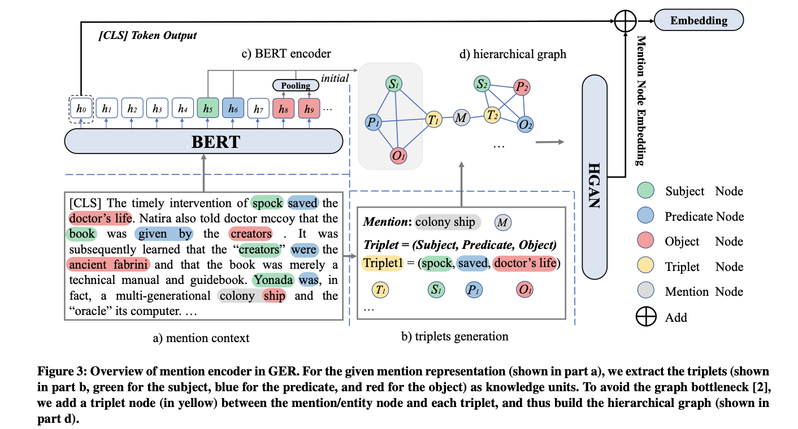

# GER-WSDM2023
This repo contains the code for our WSDM 2023 paper:
[Modeling Fine-grained Information via Knowledge-aware Hierarchical Graph for Zero-shot Entity Retrieval](https://arxiv.org/pdf/2211.10991v1.pdf?_blank") by [Taiqiang Wu](https://wutaiqiang.github.io?_blank), Xingyu Bai, Weigang Guo, Weijie Liu, Siheng Li, Yujiu Yang.

There is an [explaination blog](https://zhuanlan.zhihu.com/p/587811299?_blank) for this paper (in Chinese).


## Overview
For the zero-shot entity retrieval task, a general way is to embed them in a dense space and calculate similarity scores to retrieve entities for the given mention.Intuitively, the sentence embeddings model the information of whole sentence rather than the mention/entity. When the attention scores from the [CLS] token to mentions/entities are relatively low, such sentence embeddings may be misled by other high-attention words, leading to a shift in the semantic vector space.

<!--  -->
<div align=center>

</div>

In this paper, we propose a novel Graph enhanced Entity Retrieval (GER) framework. Our key insight is to learn extra fine-grained information about mentions/entities as complementary to coarse-grained sentence embeddings. We extract the knowledge units as the information source and design a novel Graph Neural Network to aggregate these knowledge units.



## Reproduction
### Environment
cuda:11.0
Run this to create a conda env:
```
pip install -r requirement.txt
```

### Data Preprocess

For Zeshel and other entity linking dataset, please follow [this](https://github.com/facebookresearch/BLINK?_blank) to get them. Put the data into folder: data/zeshel/blink_format  data/zeshel/documents. When training, we will preprocess the data for the first time and reuse the cache after that. The preprocess may take a while. 

Also, you can download the processed data via [this](https://pan.baidu.com/s/1hWIKYPVFqn0zxCJWwJlLgQ?pwd=y41r?_blank) directly.

### Entity Retrival

Entity retrieval: (please change the @XXX to your own parameter) 
```
python3 -u ger/train.py \
    --dataset_path data/zeshel \
    --pretrained_model bert-base-uncased \
    --name @name \
    --log_dir @path_to_save_log  \
    --mu @coarse_info_weight \
    --epoch 10 \
    --train_batch_size 128 \
    --eval_batch_size 128 \
    --encode_batch_size 128 \
    --eval_interval 200 \
    --logging_interval 10 \
    --graph \
    --gnn_layers 3 \
    --learning_rate 2e-5 \
    --do_eval \
    --do_test \
    --do_train \
    --data_parallel \
    --dual_loss \
    --handle_batch_size 4 \
    --return_type hgat 
```
The meaning of some parameters is as follows:

_pretrained_model_: str, the PLM backbone for encoder.

_name_: str, the fold name to save generate data

_log_dir_: str, the fold to save "name" fold

_mu_: float, the weight for coarse-grained information

_graph_: boolen, whether to use graph information

_dual_loss_: boolen, please refer to eq 12 in the paper

_return_type_: str, type for vector to return. __bert_only__: the sentence embedding defined by [CLS] token; __bert_only_mean__: sentence embedding by the mean of all token; __node_mean_only__: the coarse information defined by the mean of all graph node embeddings from BERT; __node_mean_add__: the coarse information defined by the mean of all graph node embeddings from BERT + the sentence embedding defined by [CLS] token; __node_mean_max__: the coarse information defined by the max of all graph node embeddings from BERT + the sentence embedding defined by [CLS] token; __node_max_only__: the coarse information defined by the max of all graph node embeddings from BERT; __node_max_add__: the coarse information defined by the max of all graph node+ the sentence embedding defined by [CLS] token; __linear_attention__: the representations of mention/entity tokens from BERT; __gat__: the coarse-grained information from gat + BERT CLS; __hgat__: our method, the coarse-grained information from HGAN + BERT CLS.

Moreover, --train_ratio is optional for few sample setting. If we set --train_ratio 0.6, we would train the model by 60% training samples.


### Entity Ranking

For entity ranking stage, you can refer to the bash/cross/start.sh.

## Citation

Please cite our paper if you find this paper helpful
```
@article{DBLP:journals/corr/abs-2211-10991,
  author    = {Taiqiang Wu and
               Xingyu Bai and
               Weigang Guo and
               Weijie Liu and
               Siheng Li and
               Yujiu Yang},
  title     = {Modeling Fine-grained Information via Knowledge-aware Hierarchical
               Graph for Zero-shot Entity Retrieval},
  journal   = {CoRR},
  volume    = {abs/2211.10991},
  year      = {2022},
  url       = {https://doi.org/10.48550/arXiv.2211.10991},
  doi       = {10.48550/arXiv.2211.10991},
  eprinttype = {arXiv},
  eprint    = {2211.10991},
  timestamp = {Thu, 24 Nov 2022 15:52:33 +0100},
  biburl    = {https://dblp.org/rec/journals/corr/abs-2211-10991.bib},
  bibsource = {dblp computer science bibliography, https://dblp.org}
}
```

## Contact

If you have any question, please contact via github issue or email me through wtq20(AT).mails.tsinghua.edu.cn 

---
This code is modified based on [MuVER](https://github.com/Alibaba-NLP/MuVER?_blank), we thank for their efforts.
